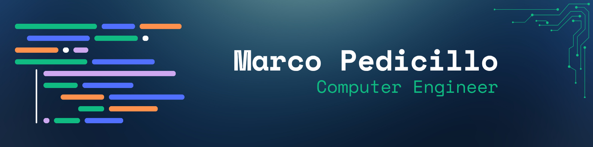

<!-- 

  

 -->

# Hi, I'm Marco 👋
📍 Based in Rome, Italy

I'm a Computer Engineering M.Sc. student at Sapienza University of Rome, with a multidisciplinary background in software development, artificial intelligence, machine learning, data analysis, databases and distributed systems.

I'm currently working on my Master's thesis in Bioinformatics, focused on multi-omics analysis of TCGA-LUSC data for feature selection and the identification of potential molecular biomarkers.

## 📌 Featured Projects:

- **TCGA-LUSC Multi-Omics Analysis**  
  Multi-omics and clinical data integration for feature selection and candidate biomarker discovery.

- **Blackjack Reinforcement Learning Agent**  
  Comparison between Tabular Q-Learning and Deep Q-Network approaches.

- **Out-of-Distribution Detection for Image Classification**  
  ResNet50-based image classification with OOD detection using Outlier Exposure and energy-based learning.

- **Relational vs NoSQL Database Performance Analysis**  
  Performance comparison between PostgreSQL and Neo4j using SQL and Cypher queries on MovieLens 32M.

- **Steply – Android Fitness Tracking App**  
  Android fitness application developed in Kotlin with GPS tracking, sensors, Firebase and REST APIs.

## 📫 Get in touch:
- Email: marco.pedicillo@outlook.it

## 🛠️ Tech Stack:

<picture>
  <source media="(prefers-color-scheme: dark)" srcset="https://raw.githubusercontent.com/Marco-Pedicillo/Marco-Pedicillo/output/github-snake-dark.svg" />
  <source media="(prefers-color-scheme: light)" srcset="https://raw.githubusercontent.com/Marco-Pedicillo/Marco-Pedicillo/output/github-snake.svg" />
  
</picture>
